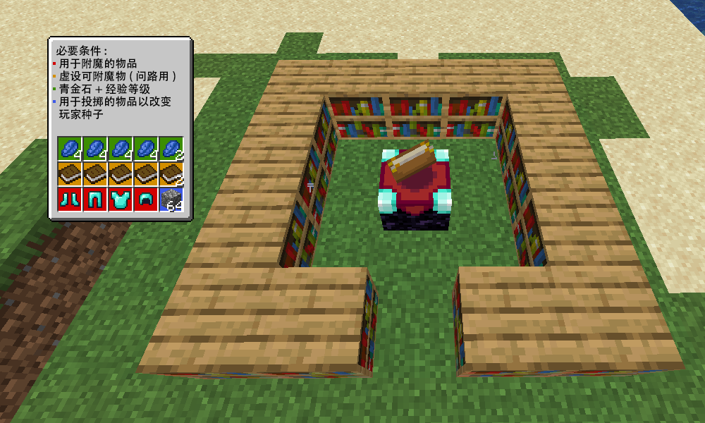

# MC 附魔破解器教程

在此页面中，我将解释如何使用 Enchantment Cracker 工具。

## 你将需要:

- 任何你想要附魔的物品。
- 数量相同的虚设附魔物。额外再加 2，用于计算玩家种子。
- 用于附魔的青金石和等级。每个附魔一个物品需要 4 个青金石 + 等级，额外再加 2 个青金石和 29 个等级。
- 一个附魔的区域，有易于操作的书架（我使用火把来阻挡附魔台和书架的连接）。
- 种子破解工具 (https://github.com/Earthcomputer/EnchantmentCracker/)

**所有这些都需要在开始附魔之前取得。**

在这个例子中，我想为全套钻石盔甲附魔，所以我需要：

- 那副钻甲
- 6 个虚设可附魔物（我用的是书）
- 18 颗青金石（每件附魔 4 颗 + 2 颗）
- 41 经验等级（每件附魔 4 个等级 + 29 个等级）
- 附魔区域 + 破解工具

> [!IMPORTANT]\
> 整个过程中请勿进行任何其他操作。很多操作都会更新你的玩家种子，比如冲刺或丢弃物品等。如果你进行任何操作，整个过程都必须重新开始。这就是为什么在开始之前必须完成所有操作，因为大多数（如果不是全部的话）经验刷取都会更新你的玩家种子，完成其他操作也会更新你的玩家种子。

## 第一步：准备你的附魔种子

为了确保你的附魔种子从一开始就正确，请用 1 颗青金石和 1 级附魔等级为一个虚设可附魔物附魔。你的附魔种子只有在附魔完成后才会更新，但你的玩家种子（附魔种子的来源）可以通过多种方式更新，例如丢弃物品——这在我们之后会用到。

不要将虚设可附魔物扔到地上。这会改变你的玩家种子并中断整个过程。不过，你可以将其放入箱子中。

## 第二步：在破解器上填写附魔信息

在工具上的书架中的数字栏中输入书架数量，并在下方输入等级要求。结果应该如上图所示。

## 第三步：寻找第一个种子

按下 “检查” 按钮，等待它找到你可能的种子。\
完成后，它会告诉你根据你提供的信息有多少可能的种子。

## 第四步：继续搜索

将书架数量减少 1，然后再次输入信息。这会减少可能的种子数量。\
可以参考 [wiki](https://minecraft.wiki/w/Enchanting_mechanics#Selecting_an_enchantment_level) 使用火把来禁用指定数量的书架。

重复步骤直到……

## 第五步：找到第一个种子

你找到了第一颗附魔种子。它将自动填入 “XP种子 1” 中。

通常，当你的书架数量减少到 10 个时就会发生这种情况，但实际上我在 10 个书架时仍然有 2 个可能的种子。

如果显示 “没有可能的种子”，请按 “重置” 并从步骤 2 重新开始。
这通常意味着你输入了一些错误的信息，但也可能意味着你正在玩的服务器的操作有所不同，在这种情况下该工具无法使用。

## 第六步：搜索第二个种子

按 “重置”，重复步骤 1-5。

## 第七步：找到第二颗种子

现在你拥有了两颗附魔种子。这意味着……

## 第八步：计算玩家种子

现在你可以点击 “计算种子”，如果一切顺利，系统将计算出你的完整玩家种子。\
如果此步骤失败，你可能需要重新开始。

但是，如果你在计算第一个种子之前忘记为虚设可附魔物附魔，你可以将第一个种子替换为第二个种子（第二个种子留空），然后返回步骤 6。

现在到了有趣的部分：利用机制获利！

## 第九步：选择你想要的附魔

现在你已经拥有了玩家种子，你可以在顶部选择要附魔的物品（所有装备材料均支持），然后在下方选择你想要的附魔。

如果你不想要某个附魔，请按其旁边的 X。\
如果你想要某个附魔，请按其旁边的 1-5（如果只有一个等级，请按 +）。\
如果你不介意某个附魔，请保留它。\
选择你想要的附魔时，你选择的等级是最低等级时。你得到的附魔结果可能会比你指定的更好。

选定附魔后，点击 “计算”，信息将显示在下方：

- 圆石：需要丢弃的单件物品数量（为了方便起见，数值较大的物品会显示堆叠数量，但你仍应每次只丢弃一个）
- 青金石：需要消耗多少等级
- 书架：需要使用多少个书架

> [!NOTE]\
> 物品可能不会列出可附魔的最高等级，例如，钻石剑不会列出锋利度5，但金剑会。这是因为该物品的可附魔性使其无法直接获得该附魔。

如果要丢弃的物品数量是数字：

- 按 Q 丢弃指定数量的物品（如果为 0，则忽略此步骤）(可以捡起)
- 为虚设可附魔物附魔
- 使用指定等级和书架数量为你指定的物品附魔
- 按 “完成” 更新工具上的种子

如果要丢弃的物品数量为空：

- 直接为你指定的物品附魔，本次无需丢弃物品或为虚设可附魔物附魔
- 按 “完成”

如果要消耗的等级或需要的书架数量是 “-”：

尝试所有组合（最多掉落 10000 件物品）后，仍未找到所需的附魔。这可能是因为你所需的附魔条件过于严格，或者你遇到了无法实现的组合（锋利 + 节肢动物克星）。

> [!NOTE]\
> 书籍附魔非常挑剔的，因为书籍很可能找不到你想要的附魔（或者需要多次丢弃）。这是因为书籍可以带有任何非宝藏附魔。
